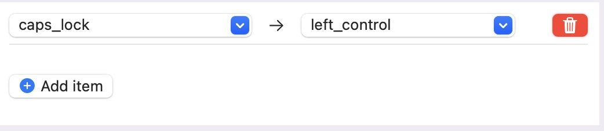

# My Mac Setup

## Prerequisites

Install developer tools.

```
xcode-select -–install
```

## Building

### Including Bootstrapping

```
./prepare.sh && ./build.sh
```

Above sets up `brew`, `python`, `pip` and `ansible` before running the `playbook.yml`.

### Ansible Only

```
./build.sh
```

## Configuration

### Oh My Zsh Powerlevel10K

```
p10k configure
```

Allow fonts to be installed.

### iTerm2

#### Change appearance

Preferences→Profiles→Colors

- →Color Presets→Solarized Dark
- Set Background to #002b36

### Karabiner Elements

#### Map CAPS Lock to Ctrl-L

Under _Simple Modifications_, map CAPS to Ctrl-Left.



#### Map Escape to CAPS Lock

Go to

https://ke-complex-modifications.pqrs.org/

and search for

```
ctrl + [ escape
```

Select _Vim style escape key mapping_

Import

Enable _Map ctrl + [ to escape_

#### Vim style arrow keys

Go to

https://ke-complex-modifications.pqrs.org/

and search for

```
vi style arrows
```

Select _Vim style escape key mapping_

Import

Enable _Fn + h/j/k/l to Arrows_
